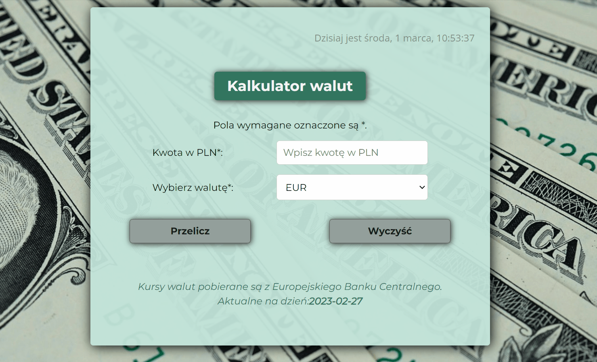

# Currency Conventer - react
 
## Demo
[See my Currency Conventer](https://justynaboesche.github.io/Currency-conventer-react/)
## Description
I have created an application that allows you to exchange Polish currency PLN into some other currencies. Current exchange rates are downloaded from the external API from https://exchangerate.host/. This is another version of currency-converter created as part of YouCode course.

This project was bootstrapped with [Create React App](https://github.com/facebook/create-react-app).

This simple currency-converter allows you to:
- enter your amount of money in PLN,
- select the currency from the list you want to convert into,
- get the result by clicking the 'Przelicz' button,
- reset the amount in PLN and the result by clicking the 'Wyczyść' button. 

The application has been prepared to be used in convenient way also on smaller devices.
## How it works

## Technologies used in the project
To create the application I have used:
- HTML 5
- CSS (Grid, Flex, media queries)
- Normalize.css
- JavaScript ES6+
- React
- Create-react-app
- Styled-components
- ThemeProvider
- React Hooks (useState, useState, custom hooks)
- Npm and webpack
- Axios
- Downloading data from external API
- Async/await
- Error handling

## Available Scripts

In the project directory, you can run:

### `npm start`

Runs the app in the development mode.\
Open [http://localhost:3000](http://localhost:3000) to view it in your browser.

The page will reload when you make changes.\
You may also see any lint errors in the console.

### `npm run build`

Builds the app for production to the `build` folder.\
It correctly bundles React in production mode and optimizes the build for the best performance.

The build is minified and the filenames include the hashes.\
Your app is ready to be deployed!

See the section about [deployment](https://facebook.github.io/create-react-app/docs/deployment) for more information.

### `npm run eject`

**Note: this is a one-way operation. Once you `eject`, you can't go back!**

If you aren't satisfied with the build tool and configuration choices, you can `eject` at any time. This command will remove the single build dependency from your project.

Instead, it will copy all the configuration files and the transitive dependencies (webpack, Babel, ESLint, etc) right into your project so you have full control over them. All of the commands except `eject` will still work, but they will point to the copied scripts so you can tweak them. At this point you're on your own.

You don't have to ever use `eject`. The curated feature set is suitable for small and middle deployments, and you shouldn't feel obligated to use this feature. However we understand that this tool wouldn't be useful if you couldn't customize it when you are ready for it.

